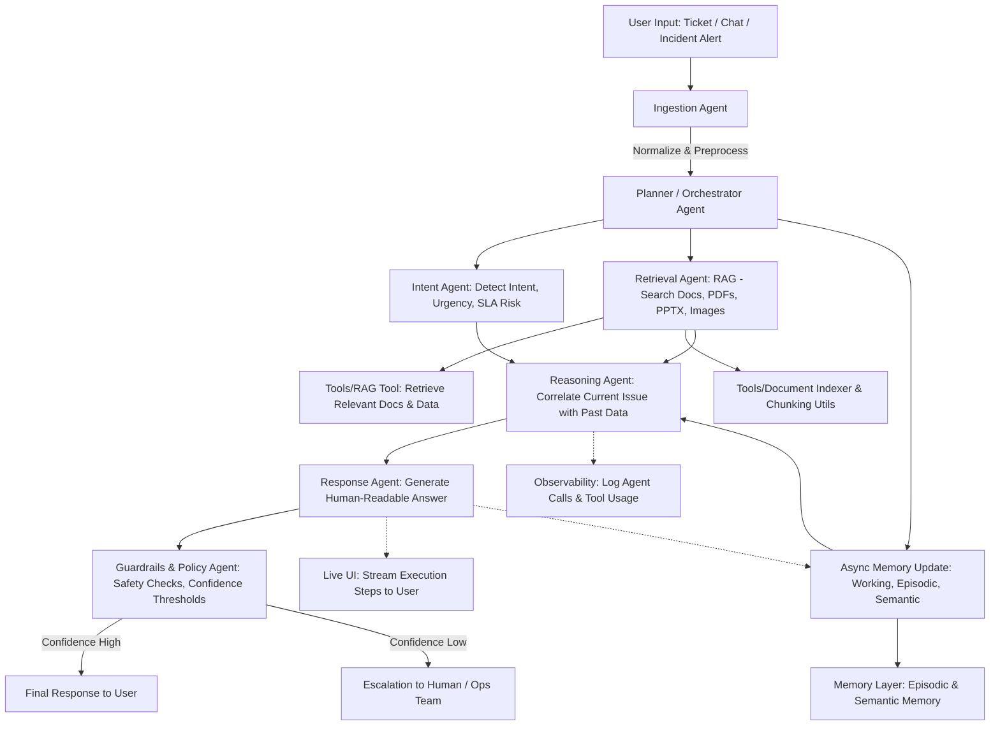

# OpsAI

OpsAI is a reference implementation and scaffold for building a collaborative agent system that behaves like a small support/ops team. It demonstrates clear agent boundaries, retrieval-augmented generation (RAG), explicit memory types, guardrails, planning & delegation, and live observability.

This repository is organized to be used with an Agent Development Kit (for this project you'll be using Google ADK) and an OpenAI-compatible model (provide your OpenAI API key via environment variable). The README below summarizes the architecture, minimum requirements, an optimal folder structure, and quick start instructions.

## Key concepts

- Retrieval-First RAG: retrieval runs before generation; retrieval, reasoning, and response synthesis are separate stages and all retrieved context must be referenced in outputs.
- Chunking & overlap: documents are chunked with overlap to preserve semantic continuity. Typical starting values: chunk_size=1000 tokens, overlap=200 tokens (tune per dataset).
- Memory types: working (short-lived), episodic (past incidents & conversations), semantic (runbooks, docs).
- Guardrails: safety & escalation policies with confidence thresholds; guardrails must block violence, self-harm, sexual content, hate, and jailbreak attempts.

## Agent overview

Each agent should live in its own module/file under `agents/` (see folder structure). Core agents:

- Ingestion Agent: normalize incoming tickets/alerts, extract metadata, and create a working memory item.
- Planner / Orchestrator Agent: decide execution strategy (serial/parallel/async) and delegate tasks to specialized agents.
- Intent & Classification Agent: detect intent, urgency, SLA risk, and recommended priority.
- Knowledge Retrieval Agent (RAG): search and return relevant chunks from documents (PDF, DOCX, PPTX, TXT, images with OCR), including provenance metadata.
- Memory Agent: read/write episodic & semantic memory stores; persists memory across requests.
- Reasoning / Correlation Agent: correlate the current issue with past incidents and metrics, identify root causes and patterns.
- Response Synthesis Agent: synthesize human-readable answers and include citations to retrieved sources.
- Guardrails & Policy Agent: applies safety checks, confidence thresholds, and decides auto-response vs escalation.

## Architecture diagram

Retained from the original file — the repo expects a visual flowchart (Mermaid) for docs and UI rendering:



## Optimal folder structure

This structure is optimized for Google ADK-based development, clear agent separation, and observability.

```
OpsAI/
├── agents/                    # Agent modules (one file per agent)
│   ├── ingestion.py           # Ingestion Agent
│   ├── planner.py             # Planner / Orchestrator
│   ├── intent.py              # Intent & Classification
│   ├── retrieval.py           # Knowledge Retrieval (RAG)
│   ├── memory_agent.py        # Memory Agent (episodic/semantic)
│   ├── reasoning.py           # Reasoning / Correlation
│   ├── response.py            # Response Synthesis
│   └── guardrails.py          # Guardrails & Policy Agent
├── tools/                     # Tooling (indexer, RAG, connectors)
│   ├── doc_indexer.py         # Chunking, embedding interface
│   ├── rag_tool.py            # Retriever wrapper used by retrieval agent
│   └── ocr.py                 # OCR helpers for images/PDFs
├── memory/                    # Memory store implementations and migrations
│   ├── store.py               # Abstract memory store interface
│   ├── sql_store.py           # Example persistent store (sqlite/postgres)
│   └── episodic/              # Episodic memory formats and export
├── data/                      # Example documents & synthetic dataset for testing
│   └── sample_docs/           # (PDF, DOCX, PPTX, images)
├── ui/                        # Observability & live-stream UI (web app)
│   ├── server.py              # Minimal web server to stream agent events
│   └── static/                # Frontend assets
├── configs/                   # Configuration (chunk sizes, thresholds)
│   └── default.yml
├── scripts/                   # Utility scripts (ingest, index, run-demo)
│   └── ingest_sample.py
├── tests/                     # Unit & integration tests (fast, focused)
├── examples/                  # Example scenarios (ticket JSON, runs)
├── notebooks/                 # Analysis and debug notebooks
├── requirements.txt           # Python dependencies (see below)
└── README.md
```

Short notes:
- Keep each agent file small and focused; prefer composition over monoliths.
- Tools (indexing, OCR, RAG) are separate from agents so they can be reused and tested independently.
- Memory persistence should support exports and user-driven deletion/modification via the UI.

## Recommended configuration defaults

- chunk_size: 1000 tokens
- chunk_overlap: 200 tokens
- retrieval_top_k: 8
- guardrail_confidence_threshold: 0.65

Tune these values based on dataset size, model, and latency requirements.

## Getting started (local / dev)

1. Create a Python virtual environment and activate it.

```bash
python3 -m venv .venv
source .venv/bin/activate
```

2. Install dependencies. This project expects you to install Google ADK and an OpenAI client. Add providers you need to `requirements.txt`.

```bash
pip install -r requirements.txt
# Example packages (add versions appropriate for your environment):
# pip install google-adk openai
```

3. Set your OpenAI API key (used by Google ADK or any OpenAI client):

```bash
export OPENAI_API_KEY="sk-..."
```

4. Run the sample ingestion + index script to populate a small sample dataset (example):

```bash
python scripts/ingest_sample.py --data-dir data/sample_docs
python tools/doc_indexer.py --build-index
```

5. Start the demo orchestrator (this will use Google ADK wiring to instantiate agents):

```bash
python agents/planner.py --run-demo
```

Notes: adapt the exact commands to your Google ADK setup and entrypoint. The codebase is intentionally provider-agnostic: the orchestrator should wire in Google ADK primitives for agent lifecycle and inter-agent messaging.

## Observability & streaming

- Agents must log: agent name, inputs, tool calls (with inputs), results, timestamps, and final decision.
- The `ui/server.py` should subscribe to agent events and stream them to the browser so an operator can see: which agents ran, tools used, retrieved documents (with provenance), and the final response.

## Guardrails & safety

- Implement rule-based filters and a final policy check in `agents/guardrails.py`.
- Maintain a declarative blocklist and pattern list separate from code for easy updates.

## Tests

- Add unit tests for each agent's logic in `tests/` and a small integration test that runs a short scenario end-to-end.

## Next steps / scaffold work items

1. Create minimal agent stubs in `agents/` that raise NotImplementedError but expose the expected interface.
2. Provide a `requirements.txt` with pinned versions and an example `configs/default.yml`.
3. Implement `tools/doc_indexer.py` and a small in-memory vector store for prototyping.
4. Build a tiny `ui/server.py` that streams events (WebSocket) for observability.

---

If you want, I can now:

1) Add the suggested `requirements.txt` and `configs/default.yml`.
2) Create the `agents/` scaffolding files with interfaces and a minimal demo runner using Google ADK wiring.
3) Generate a sample `scripts/ingest_sample.py` to create synthetic files for testing.

Tell me which of the above (1/2/3 or combination) you'd like me to create next and I'll proceed.

